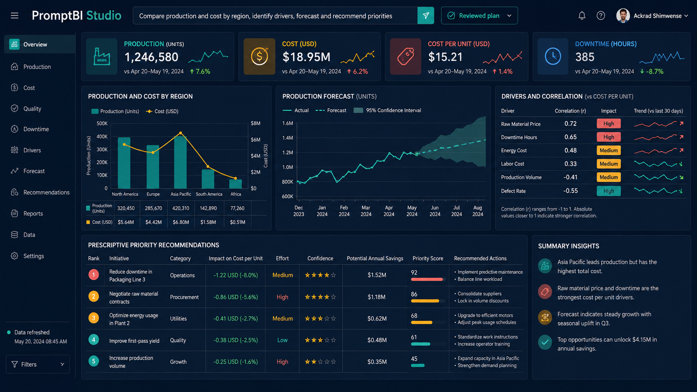
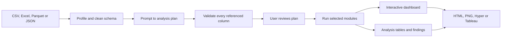

# PromptBI Studio

**Built by Ackrad Shimwense**

PromptBI Studio turns a plain-language analysis request into a visible, validated plan, runs the approved analysis, builds interactive dashboards, and prepares data for Tableau. The core analysis works locally without a Tableau license; Hyper and publishing support are optional delivery steps.



*The dashboard above uses fictional operations data to demonstrate descriptive, predictive and prescriptive outputs.*

## Project summary

| User starts with | PromptBI produces |
|---|---|
| CSV, Excel, Parquet, JSON or JSONL | Cleaned schema and completeness profile |
| A written business question | Reviewable JSON analysis plan |
| Approved dimensions, measures and target | Descriptive, diagnostic, predictive and prescriptive tables |
| Chart requirements | Interactive Plotly dashboard and optional PNGs |
| Tableau delivery requirement | Hyper extract or reviewed publication package |

## Why this matters

Many dashboard requests begin clearly in business language but become disconnected from the data during implementation. Someone asks to “compare cost and production, identify the drivers, forecast next quarter and recommend priorities,” yet the file may not contain the requested columns, the forecast may be too weak, or a recommendation may ignore costs and constraints.

PromptBI keeps the request, data schema, chosen methods, warnings and outputs connected. It is useful in operations, manufacturing, energy, mining, logistics, finance, sales, project controls and any team that repeatedly turns flat files into decision-support dashboards.

## The solution



The plan is shown before execution. If a requested field does not exist, validation stops the run instead of inventing a column.

## Analysis modes

- **Descriptive:** profiles, grouped KPIs, distributions and missingness.
- **Diagnostic:** correlations and outlier screens with causality warnings.
- **Predictive:** random-forest holdout evaluation and baseline time-trend forecasts.
- **Prescriptive:** observed-data rankings and candidate identification with explicit limits.
- **Visual:** bar, line, area, scatter, histogram, box, pie, treemap, sunburst, heatmap and coordinate maps.

## Code behind the workflow

### One pipeline from approved plan to deliverables

```python
def run_analysis(frame, prompt, plan=None):
    selected = plan or deterministic_plan(prompt, frame)
    selected.validate(list(frame.columns))

    outputs = run_modules(frame, selected)
    figures = []
    for spec in selected.charts:
        try:
            figures.append(create_figure(frame, spec))
        except (ValueError, TypeError) as exc:
            outputs.warnings.append(
                f"Chart {spec.title or spec.kind!r} skipped: {exc}"
            )
    return AnalysisResult(selected, outputs, figures)
```

### Reproducible predictive evaluation

```python
x_train, x_test, y_train, y_test = train_test_split(
    clean[features], clean[target],
    test_size=0.25,
    random_state=42,
)
model = RandomForestRegressor(
    n_estimators=150,
    random_state=42,
    n_jobs=-1,
)
model.fit(x_train, y_train)
predicted = model.predict(x_test)

metrics = {
    "holdout_mae": float(mean_absolute_error(y_test, predicted)),
    "holdout_r2": float(r2_score(y_test, predicted)),
}
```

### Prescriptive output stays honest about its limits

```python
ranking = frame.groupby(dimension, dropna=False)[target].agg(
    ["sum", "mean", "median", "count"]
).reset_index()
ranking["rank_by_mean"] = ranking["mean"].rank(
    ascending=False, method="dense"
).astype(int)

warnings.append(
    "Recommendations rank observed data only; add real costs, constraints, "
    "uncertainty and decision authority before action."
)
```

### Every run writes reviewable artifacts

```python
(root / "analysis_plan.json").write_text(
    json.dumps(self.plan.to_dict(), indent=2), encoding="utf-8"
)

for name, table in self.outputs.tables.items():
    table.to_csv(root / "tables" / f"{name}.csv", index=False)

write_dashboard(
    root / "dashboard.html",
    self.figures,
    self.plan.goal,
    self.outputs.findings,
    self.outputs.warnings,
)
```

## Technology used

- Python and pandas for data loading, profiling and transformation
- Streamlit for the local interactive application
- Plotly for interactive charts and dashboard generation
- NumPy and scikit-learn for diagnostic/predictive modules
- Tableau Hyper API for extract creation
- Tableau Server Client/REST API for licensed Cloud or Server publication
- Deterministic offline planner with an optional configurable language-planning adapter
- JSON plans, CSV analysis tables and self-contained HTML output
- PyArrow/openpyxl adapters for Parquet and Excel workflows

## Run in VS Code

```powershell
py -3.11 -m venv .venv
.\.venv\Scripts\python.exe -m pip install --upgrade pip
.\.venv\Scripts\python.exe -m pip install -e ".[tableau,static,dev]"
.\.venv\Scripts\python.exe -m streamlit run app.py
```

For the analysis application without Tableau extras:

```powershell
.\.venv\Scripts\python.exe -m pip install -e ".[dev]"
```

## Command-line example

```powershell
$env:PYTHONPATH = (Resolve-Path .\src).Path
python -m promptbi.cli examples\sample_operations.csv `
  --prompt "Compare production and cost by region, identify drivers, forecast and recommend priorities" `
  --output outputs\operations_review
```

## Output package

```text
outputs/operations_review/
├── analysis_plan.json
├── findings.json
├── dashboard.html
├── tables/
│   ├── profile.csv
│   ├── correlations.csv
│   ├── feature_importance.csv
│   ├── trend_forecast.csv
│   └── prescriptive_ranking.csv
├── static/                 # optional PNG output
├── tableau/                # optional Hyper/publication package
└── source_snapshot/        # when enabled by the user
```

## Tableau delivery

- **Tableau Cloud/Server:** create a Hyper datasource and publish using a Personal Access Token held only in the current session.
- **Tableau Public:** create a review package for manual opening and publication. Tableau Public makes the workbook and underlying data public, so confidential data must not be included.
- **No Tableau license:** use the interactive `dashboard.html` and exported analysis tables.

## Verification

```powershell
$env:PYTHONPATH = (Resolve-Path .\src).Path
python -m unittest discover -s tests -v
```

The validation run completed **6 tests successfully**. One optional predictive test is skipped when scikit-learn is not installed in the validation interpreter; scikit-learn is declared in the predictive dependency set.

## What I would build next

- Add governed connectors for SQL Server, PostgreSQL, Snowflake and REST APIs.
- Add scheduled refresh with dataset versioning and row-count checks.
- Add constraint-based optimization rather than observed-data ranking alone.
- Add forecasting backtests, prediction intervals and model comparison.
- Add dashboard themes and automatic mobile layouts.
- Add a workbook template layer for faster Tableau handoff.
- Add role-based approval and a signed run manifest for enterprise use.

## Analytical boundary

The application accelerates analysis; it does not turn weak data into a reliable decision. Forecasts, causal claims, safety decisions, financial recommendations and engineering actions still require suitable data, uncertainty treatment, domain assumptions and accountable review.
