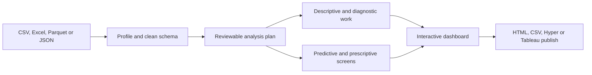

# PromptBI Studio 1.0

PromptBI Studio is a local, editable Python application that converts a plain-language analytics
request into a reviewable plan, executes the approved plan, produces interactive dashboards and
analysis tables, and prepares data for Tableau.

It is deliberately vendor-flexible: the analysis and interactive HTML dashboard work without a
Tableau license. Tableau-specific delivery is added at the end.

## How I use it

I load a real operations table and write what I would normally ask an analyst: “Compare cost and
production by region, show the drivers, forecast the next six periods, and rank the priorities.”
The application first turns that sentence into a visible plan. Nothing runs until the columns and
assumptions have been checked.



The offline planner is ordinary, inspectable Python. For example, analysis types are added only
when the request actually asks for them:

```python
analyses = ["descriptive"]
if any(word in text for word in ("why", "driver", "correlation", "diagnostic")):
    analyses.append("diagnostic")
if any(word in text for word in ("forecast", "predict", "projection", "trend")):
    analyses.append("predictive")
if any(word in text for word in ("recommend", "optimize", "prescriptive", "scenario")):
    analyses.append("prescriptive")
```

## Capabilities

- CSV, Excel, Parquet, JSON, and JSONL input.
- Automatic column cleaning, type inspection, completeness profiling, and schema display.
- Deterministic offline prompt planner, plus an optional OpenAI-compatible LLM planner.
- The plan is shown as JSON and must be reviewed before execution.
- Descriptive summaries, grouped KPIs, missingness, and distributions.
- Diagnostic correlation and outlier screening with explicit causality warnings.
- Predictive random-forest holdout evaluation and baseline time-trend forecasts.
- Prescriptive screening/ranking with explicit decision limitations.
- Bar, line, area, scatter, histogram, box, pie, treemap, sunburst, heatmap, and coordinate maps.
- Responsive interactive HTML dashboard and downloadable CSV/JSON analysis package.
- Optional PNG exports through Kaleido.
- Tableau `.hyper` extract creation with the official Hyper API.
- PAT-authenticated datasource/workbook publishing to Tableau Cloud or Tableau Server.
- Tableau Public review package for manual publication.

## Start in VS Code on Windows

Open this folder in VS Code, then run:

```powershell
py -3.11 -m venv .venv
.\.venv\Scripts\python.exe -m pip install --upgrade pip
.\.venv\Scripts\python.exe -m pip install -e ".[tableau,static,dev]"
.\.venv\Scripts\python.exe -m streamlit run app.py
```

Open the local URL printed by Streamlit. Alternatively, press **F5** and choose
**PromptBI Studio** after selecting the `.venv` interpreter.

If Tableau libraries are not needed, install the base app with:

```powershell
.\.venv\Scripts\python.exe -m pip install -e ".[dev]"
```

## Command-line example

```powershell
$env:PYTHONPATH = (Resolve-Path .\src).Path
python -m promptbi.cli examples\sample_operations.csv `
  --prompt "Compare production and cost by region, identify drivers, forecast and recommend priorities" `
  --output outputs\sample
```

Add `--hyper --public-bundle` after installing the Tableau optional dependencies.

## Tableau Cloud and Tableau Server

PromptBI creates a Hyper data source and can publish it through Tableau's supported REST client.
Use a Personal Access Token, not a hard-coded password. In the application, enter:

- the Tableau Cloud pod or Tableau Server URL;
- site content URL (blank for the default site);
- project name;
- PAT name and PAT secret; and
- the published datasource name.

The secret is held in the running Streamlit session and is not written by this application.
Publishing still requires the Tableau permissions assigned to that token's user.

To publish a workbook, create/review the workbook in Tableau Desktop, package local resources as
`.twbx`, and call `promptbi.tableau.publish_to_cloud_or_server(..., kind="workbook")`.

## Tableau Public

Tableau Public content and its underlying data are public. PromptBI therefore creates a review
package instead of transmitting data to an undocumented endpoint. Review the package, open its
CSV or Hyper file in Tableau Public Edition, create/review the workbook, and use
**Server > Tableau Public > Save to Tableau Public**.

Do not use Tableau Public for confidential, personal, licensed, security-sensitive, commercially
sensitive, or employer/client data.

## Live data

The current input adapters read files. A live source can be added safely by implementing a loader
that returns a pandas DataFrame, then scheduling the CLI and publishing the refreshed Hyper
datasource to Tableau Cloud/Server. Keep database and API credentials outside source control.

## Tests

```powershell
$env:PYTHONPATH = (Resolve-Path .\src).Path
python -m unittest discover -s tests -v
```

## Analytical limits

This is an engineering-grade starting platform, not an autonomous decision authority. “Any
visualization” means the supported chart catalog or a developer-added Plotly component. Causal,
forecast, optimization, safety, financial, medical, and engineering conclusions require suitable
data, domain assumptions, uncertainty treatment, validation, and accountable human approval.

The deterministic planner is reliable for common requests and exact column names. The optional
LLM planner improves language flexibility but can still make mistakes; plan validation prevents it
from inventing dataset columns, and the user reviews the JSON before analysis.

## Official Tableau interfaces used

- Tableau Hyper API for local extracts.
- Tableau Server Client / REST API for licensed Cloud or Server publishing.
- Tableau Public's documented Desktop/Public Edition save workflow.
